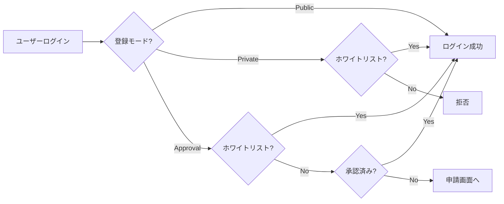

<div align="center">

# 📚 OpenLibraryRent

**マルチテナント対応 図書貸出管理システム**

PostgreSQL Row Level Security による安全なテナント分離を実現

[](https://dotnet.microsoft.com/)
[](https://kit.svelte.dev/)
[](https://www.postgresql.org/)
[](LICENSE.txt)

[デモを見る](#) | [ドキュメント](#) | [バグ報告](#)

</div>

---

## ✨ 特徴

- 🔐 **マルチテナント分離** - PostgreSQL RLSによるデータベースレベルの分離
- 🎫 **柔軟なユーザー登録** - オープン/ホワイトリスト/承認制の3モード
- 📖 **Open Library連携** - ISBNから自動で書籍情報を取得
- 📱 **ISBNスキャン** - カメラを使ったバーコードスキャン
- 🔑 **権限管理** - きめ細かいロール・権限システム
- 🚀 **Aspire対応** - 開発環境をワンコマンドで起動

---

## 🖼️ スクリーンショット

<table>
  <tr>
    <td></td>
    <td></td>
  </tr>
  <tr>
    <td align="center"><b>書籍管理</b></td>
    <td align="center"><b>貸出管理</b></td>
  </tr>
</table>

---

## 🏗️ アーキテクチャ

```
┌─────────────────────────────────────────────────────────────┐
│                        SvelteKit SPA                        │
│                    (Static Site + ZXing)                    │
└─────────────────────────────────────────────────────────────┘
                              │
                              ▼
┌─────────────────────────────────────────────────────────────┐
│                  ASP.NET Core Web API                       │
│  ┌─────────────┐  ┌─────────────┐  ┌─────────────────────┐ │
│  │   Tenant    │  │    Book     │  │      Rental         │ │
│  │ Controller  │  │ Controller  │  │    Controller       │ │
│  └─────────────┘  └─────────────┘  └─────────────────────┘ │
│  ┌─────────────────────────────────────────────────────────┐ │
│  │              Finbuckle.MultiTenant                      │ │
│  │              + Permission Filters                       │ │
│  └─────────────────────────────────────────────────────────┘ │
└─────────────────────────────────────────────────────────────┘
                              │
                              ▼
┌─────────────────────────────────────────────────────────────┐
│                     PostgreSQL                              │
│  ┌─────────────┐  ┌─────────────┐  ┌─────────────────────┐ │
│  │  Tenant A   │  │  Tenant B   │  │     Tenant C        │ │
│  │  (RLS)      │  │  (RLS)      │  │      (RLS)          │ │
│  └─────────────┘  └─────────────┘  └─────────────────────┘ │
└─────────────────────────────────────────────────────────────┘
```

---

## 🚀 クイックスタート

### 前提条件

| ツール | バージョン | リンク |
|--------|-----------|--------|
| .NET SDK | 10.0+ | [ダウンロード](https://dotnet.microsoft.com/download) |
| Node.js | 20+ | [ダウンロード](https://nodejs.org/) |
| Docker | 最新 | [ダウンロード](https://www.docker.com/) |
| PostgreSQL | 17+ | [ダウンロード](https://www.postgresql.org/download/) |

### 1️⃣ クローン

```bash
git clone https://github.com/your-org/OpenLibraryRent.git
cd OpenLibraryRent
```

### 2️⃣ 設定

`OpenLibraryRent/appsettings.Development.json` を作成：

```json
{
  "ConnectionStrings": {
    "DefaultConnection": "Host=localhost;Database=openlibraryrent;Username=postgres;Password=postgres"
  },
  "Authentication": {
    "Microsoft": {
      "ClientId": "your-client-id",
      "ClientSecret": "your-client-secret"
    }
  },
  "Encryption": {
    "Key": "your-32-character-encryption-key!!"
  }
}
```

### 3️⃣ 起動

**Aspireを使用（推奨）**：
```bash
dotnet run --project OpenLibraryRent.AppHost
```

**直接起動**：
```bash
cd OpenLibraryRent
dotnet ef database update
dotnet run
```

### 4️⃣ アクセス

- 🌐 アプリケーション: http://localhost:5000
- 📖 API ドキュメント: http://localhost:5000/swagger
- 🗄️ pgAdmin (Aspire): http://localhost:5050

---

## 📋 機能詳細

### ユーザー登録モード

| モード | 説明 | ホワイトリストユーザー |
|--------|------|----------------------|
| **🔓 Public** | 誰でもログイン可能 | - |
| **🔒 Private** | ホワイトリストのみ許可 | 即座にログイン可能 |
| **📝 Approval** | 申請→承認制 | 承認スキップでログイン |



### 権限システム

#### テナント権限
| 権限 | 説明 |
|------|------|
| `tenant.user.read` | ユーザー一覧・詳細閲覧 |
| `tenant.user.manage` | ユーザー作成・編集・削除 |
| `tenant.role.read` | ロール閲覧 |
| `tenant.role.manage` | ロール作成・編集・削除 |
| `tenant.book.read` | 書籍閲覧 |
| `tenant.book.manage` | 書籍登録・編集 |
| `tenant.rental.read` | 貸出閲覧 |
| `tenant.rental.manage` | 貸出・返却操作 |

#### システム権限
| 権限 | 説明 |
|------|------|
| `system.tenant.create` | テナント作成 |
| `system.tenant.read` | テナント一覧閲覧 |
| `system.tenant.manage` | テナント設定変更 |
| `system.tenant.delete` | テナント削除 |

---

## 📁 プロジェクト構成

```
OpenLibraryRent/
├── 📂 OpenLibraryRent.AppHost/       # Aspireホスト
│   └── AppHost.cs                    # インフラ定義
│
├── 📂 OpenLibraryRent.ServiceDefaults/ # 共通設定
│
├── 📂 OpenLibraryRent/               # メインプロジェクト
│   ├── 📂 Controllers/
│   │   ├── AuthController.cs         # 認証
│   │   ├── TenantsController.cs      # テナント管理
│   │   ├── BooksController.cs        # 書籍API
│   │   ├── RentalsController.cs      # 貸出API
│   │   ├── UsersController.cs        # ユーザー管理
│   │   ├── UserApprovalController.cs # 承認フロー
│   │   └── SystemAuthController.cs   # システム認証
│   │
│   ├── 📂 Models/
│   │   ├── ApplicationUser.cs        # ユーザー
│   │   ├── ApplicationTenantInfo.cs  # テナント
│   │   ├── Book.cs / BookCopy.cs     # 書籍
│   │   ├── Rental.cs                 # 貸出
│   │   └── UserApprovalRequest.cs    # 承認リクエスト
│   │
│   ├── 📂 Services/
│   │   ├── TenantManagementService.cs
│   │   ├── RentalService.cs
│   │   ├── OpenLibraryService.cs     # Open Library API
│   │   └── EncryptionService.cs
│   │
│   ├── 📂 Filters/
│   │   ├── RequireAnyAttribute.cs    # OR条件権限
│   │   └── RequireAllAttribute.cs    # AND条件権限
│   │
│   ├── 📂 OpenLibraryRent.Client/    # SvelteKitフロントエンド
│   │   ├── src/routes/
│   │   │   ├── [tenant]/             # テナント別ページ
│   │   │   │   ├── books/            # 書籍管理
│   │   │   │   ├── rentals/          # 貸出管理
│   │   │   │   ├── users/            # ユーザー管理
│   │   │   │   ├── apply/            # 申請フォーム
│   │   │   │   └── admin/approvals/  # 承認管理
│   │   │   └── create-tenant/        # テナント作成
│   │   └── src/lib/
│   │       ├── stores/auth.ts        # 認証ストア
│   │       └── components/           # UIコンポーネント
│   │
│   └── 📂 Migrations/                # EF Coreマイグレーション
│
└── 📂 submodules/MaskedUUID/         # UUIDマスキング
```

---

## 🔌 API リファレンス

### 認証

```http
GET  /{tenant}/auth/login          # OIDCログイン開始
GET  /{tenant}/auth/me             # 現在のユーザー情報
POST /{tenant}/auth/logout         # ログアウト
```

### システム認証（テナント作成用）

```http
GET  /api/systemauth/microsoft-login   # Microsoft OAuth開始
GET  /api/systemauth/check             # 認証状態確認
```

### テナント

```http
GET  /api/tenants                      # 一覧（システム管理者）
GET  /api/tenants/by-identifier/{id}   # 識別子で取得
POST /api/tenants/create               # 作成（Microsoft認証必要）
PUT  /api/tenants/{id}/registration-settings  # 登録設定更新
```

### 書籍

```http
GET  /{tenant}/api/books                           # 一覧
POST /{tenant}/api/books                           # 登録
POST /{tenant}/api/books/fetch-from-openlibrary/{isbn}  # Open Library取得
GET  /{tenant}/api/books/{id}/copies               # 書籍コピー一覧
```

### 貸出

```http
GET  /{tenant}/api/rentals                # 一覧
POST /{tenant}/api/rentals/borrow         # 貸出
POST /{tenant}/api/rentals/{id}/return    # 返却
GET  /{tenant}/api/rentals/overdue        # 延滞一覧
```

### ユーザー承認

```http
POST /{tenant}/api/userapproval/apply               # 申請送信
GET  /{tenant}/api/userapproval/status              # ステータス確認
GET  /{tenant}/api/userapproval/requests            # 申請一覧（管理者）
POST /{tenant}/api/userapproval/requests/{id}/approve  # 承認
POST /{tenant}/api/userapproval/requests/{id}/reject   # 却下
```

---

## ⚙️ 環境変数

| 変数名 | 必須 | 説明 |
|--------|:----:|------|
| `ConnectionStrings__DefaultConnection` | ✅ | PostgreSQL接続文字列 |
| `Authentication__Microsoft__ClientId` | ✅ | Microsoft OAuth Client ID |
| `Authentication__Microsoft__ClientSecret` | ✅ | Microsoft OAuth Client Secret |
| `Encryption__Key` | ✅ | 暗号化キー（32文字） |
| `Cors__AllowedOrigins` | | CORS許可オリジン（本番必須） |

---

## 🔧 設定例

### Microsoft OAuth設定

1. [Azure Portal](https://portal.azure.com) → アプリの登録
2. 新規登録
   - 名前: `OpenLibraryRent`
   - リダイレクトURI: `https://your-domain/auth/microsoft-callback`
3. ClientId と ClientSecret を取得

### 申請フォームのカスタマイズ

テナント設定で JSON でフィールド定義：

```json
[
  {"name": "department", "label": "部署名", "type": "text", "required": true},
  {"name": "employee_id", "label": "社員番号", "type": "text", "required": true},
  {"name": "reason", "label": "利用目的", "type": "textarea", "required": false}
]
```

---

## 🧪 テスト

```bash
# 単体テスト
dotnet test

# フロントエンド型チェック
cd OpenLibraryRent/OpenLibraryRent.Client
npm run check
```

---

## 📦 デプロイ

### Docker Compose

```yaml
version: '3.8'
services:
  app:
    image: openlibraryrent:latest
    environment:
      - ConnectionStrings__DefaultConnection=Host=postgres;Database=openlibraryrent;Username=postgres;Password=postgres
      - Authentication__Microsoft__ClientId=${MS_CLIENT_ID}
      - Authentication__Microsoft__ClientSecret=${MS_CLIENT_SECRET}
      - Encryption__Key=${ENCRYPTION_KEY}
    ports:
      - "5000:8080"
    depends_on:
      - postgres

  postgres:
    image: postgres:17
    environment:
      POSTGRES_PASSWORD: postgres
    volumes:
      - postgres-data:/var/lib/postgresql/data

volumes:
  postgres-data:
```

---

## 🤝 コントリビュート

1. フォーク
2. ブランチ作成 (`git checkout -b feature/amazing`)
3. コミット (`git commit -m 'Add amazing feature'`)
4. プッシュ (`git push origin feature/amazing`)
5. プルリクエスト作成

---

## 📄 ライセンス

このプロジェクトは [MIT License](LICENSE.txt) の下で公開されています。

---

<div align="center">

Made with ❤️ by Your Team

[⬆ トップに戻る](#-openlibraryrent)

</div>
